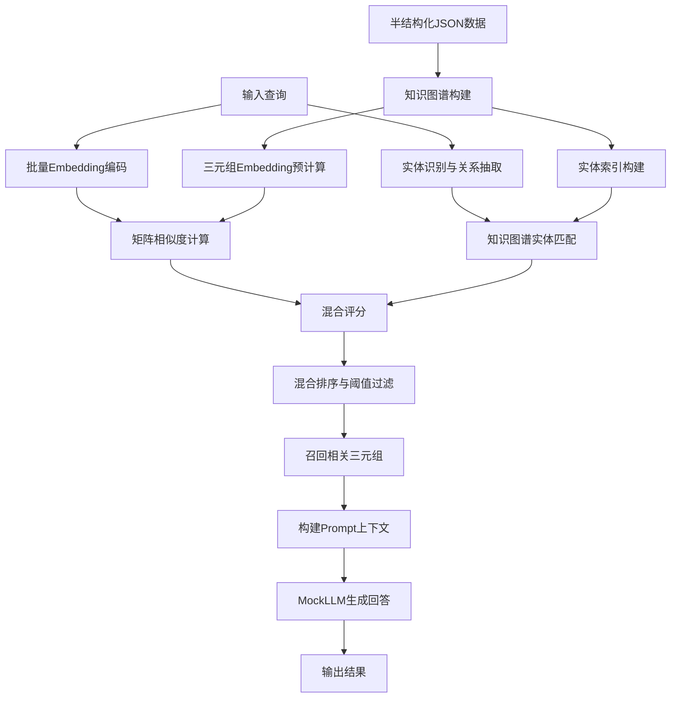

# 基于半结构化知识图谱的检索增强生成系统

## 小组成员

- 孙翌洋2243711419
- 石梓煜2241514452

## 项目概述

本项目实现了一个基于半结构化知识图谱的检索增强生成（RAG）系统。系统从半结构化JSON数据构建轻量级知识图谱，通过向量化检索技术查找相关三元组，并利用模拟大型语言模型生成自然语言回答。

## 系统架构



### 架构说明

1. **配置层** (`config.py`)：使用Python `dataclass` 实现类型安全的配置管理
2. **知识图谱层** (`kg.py`)：从半结构化JSON加载三元组，构建倒排索引和实体索引
3. **检索层** (`retriever.py`)：预计算三元组Embedding，实现混合检索（语义相似度 + 实体匹配 + 关系约束）
4. **生成层** (`generator.py`)：格式化Prompt上下文，基于实体相关性过滤后调用MockLLM生成文本
5. **应用层** (`main.py`)：串联各模块，提供完整演示流程

## 项目结构

```
.
├── config.py              # 配置管理模块
├── kg.py                  # 知识图谱模块
├── retriever.py           # 批量检索器模块
├── generator.py           # 文本生成器模块
├── main.py                # 主程序入口
├── README.md              # 项目说明文档
├── config.json            # 配置文件（示例）
└── data/
    └── kg.json            # 知识图谱数据文件（示例）
```

## 快速开始

### 环境要求

- Python 3.8+
- pip

### 安装依赖

```bash
pip install -r requirements.txt
```

### 运行演示

```bash
python main.py
```

## 配置说明

### 配置文件 (`config.json`)

```json
{
  "data": {
    "kg_file": "data/kg.json",
    "embedding_model": "all-MiniLM-L6-v2",
    "batch_size": 32
  },
  "retriever": {
    "top_k": 5,
    "similarity_threshold": 0.3,
    "use_gpu": false
  },
  "debug": true,
  "log_level": "INFO"
}
```

### 配置参数说明

| 参数                             | 类型   | 默认值               | 说明                               |
| -------------------------------- | ------ | -------------------- | ---------------------------------- |
| `data.kg_file`                   | string | `"data/kg.json"`     | 知识图谱数据文件路径               |
| `data.embedding_model`           | string | `"all-MiniLM-L6-v2"` | Sentence-BERT模型名称              |
| `data.batch_size`                | int    | `32`                 | 批量处理大小                       |
| `retriever.top_k`                | int    | `5`                  | 返回最相似的K个结果                |
| `retriever.similarity_threshold` | float  | `0.3`                | 相似度阈值，低于此值的结果将被过滤 |
| `retriever.use_gpu`              | bool   | `false`              | 是否使用GPU加速                    |
| `debug`                          | bool   | `true`               | 调试模式开关                       |
| `log_level`                      | string | `"INFO"`             | 日志级别                           |

## 数据格式

### 知识图谱数据 (`data/kg.json`)

支持两种半结构化格式：

**格式1：简洁三元组**

```json
[
  ["Python", "是一种", "编程语言"],
  ["机器学习", "是", "人工智能的子领域"]
]
```

**格式2：带元数据的完整三元组**

```json
[
  {
    "head": "Python",
    "relation": "由",
    "tail": "Guido van Rossum 创建",
    "metadata": { "年份": 1991, "置信度": 0.95 }
  }
]
```

## 模块详解

### 1. 配置模块 (`config.py`)

- 使用Python标准库的`dataclass`实现类型安全配置
- 支持嵌套配置结构（`DataConfig`, `RetrieverConfig`, `SystemConfig`）
- 提供`from_file()`方法从JSON文件加载配置
- 实现配置与代码分离，便于维护

### 2. 知识图谱模块 (`kg.py`)

- 定义`Triplet`数据类，包含头实体、关系、尾实体和元数据
- 实现`SimpleKG`类，支持从JSON加载半结构化数据
- 构建倒排索引加速关键词搜索
- 提供实体搜索和关键词搜索接口

### 3. 检索器模块 (`retriever.py`)

- 实现`BatchTripletRetriever`类，支持批量向量检索
- 使用`sentence-transformers`预计算所有三元组Embedding
- 利用`sklearn.metrics.pairwise.cosine_similarity`计算矩阵相似度
- 对查询进行实体识别，匹配知识图谱中的已知实体并给予加分
- 根据问题关键词优先匹配对应关系的三元组
- 支持阈值过滤和Top-K排序，提高检索质量

### 4. 生成器模块 (`generator.py`)

- 实现`MockLLM`类，模拟大型语言模型生成有信息量的回答
- 实现`KGTextGenerator`类，将检索结果格式化为Prompt上下文
- 对检索到的三元组进行独立评分：关系匹配（关键词权重表，越具体权重越高）> 实体匹配 > 语义相似度
- 检测到列举型查询（"都有谁"、"有哪些"等）时优先选择包含多值的三元组
- 兼顾实体匹配与关系匹配，只要有一项满足即返回答案，否则回答"知识库暂无该问题答案"
- 支持模板化Prompt构建，提供强指令约束
- 提供批量生成接口，提高处理效率

### 5. 主程序 (`main.py`)

- 串联所有模块，展示完整工作流程
- 自动创建示例数据和配置文件
- 提供详细的运行日志和结果展示
- 包含系统统计信息输出

## 课上内容

- 检索增强生成
- 基于批量三元组召回的检索增强生成
- numpy库
- 半结构化数据json
- AI辅助编程Claude Code
